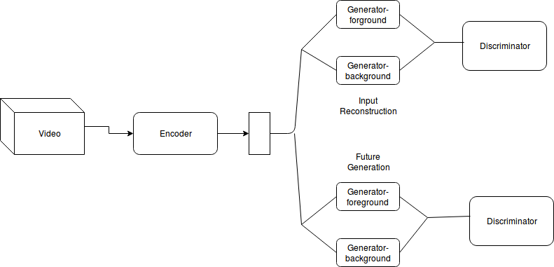
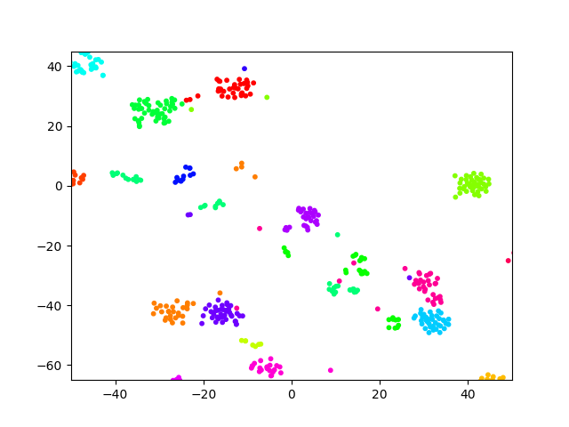
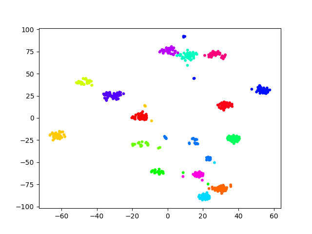
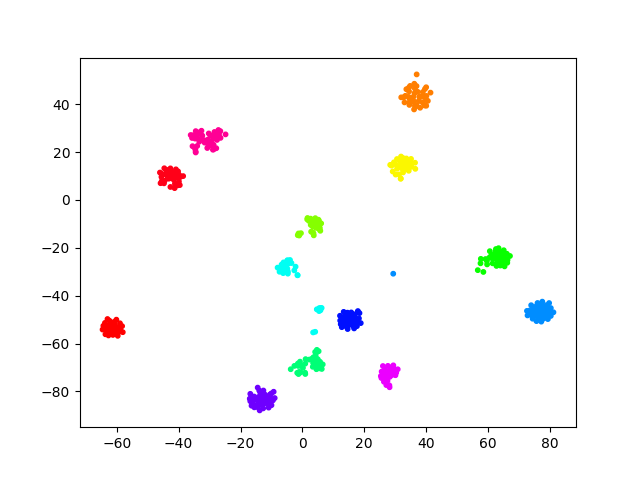

# DeepVideo

---

## Description

This repo consists of a tensorflow implementation of a novel architecture for action recognition in videos. The architecture is inspired from the MIT tinyvideo GAN architecture but is trained to do input reconstruction, future prediction, as well as classification.

Model description:
- Encoder learns an embedding from video
- This embedding is input to 2 different GAN frameworks(videoGAN from MIT paper)
- One GAN is trained to reconstruct input video from embedding
- Second GAN is trained to predict future frames from embedding
- Discriminator is used to detect if generated video is real/fake (both images as well as motion should be real for real video)
- Embeddings can be used directly for action classification (semi-supervised training)

The model is tested on two publicly available datasets: [moving MNIST](http://www.cs.toronto.edu/~nitish/unsupervised_video/mnist_test_seq.npy) and [UCF-101](http://crcv.ucf.edu/data/UCF101.php).

#### Model Architecture

## Results

#### TSNE of action embeddings

## Related works
* [Unsupervised Learning of Video Representations using LSTMs](https://arxiv.org/abs/1502.04681)
* [Generating Videos with Scene Dynamics](http://carlvondrick.com/tinyvideo/paper.pdf)
